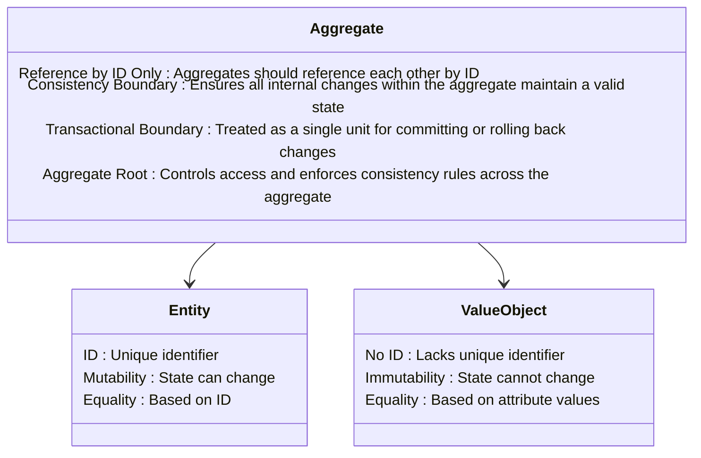

+++
title = 'Aggregates, Entities, and Value Objects'
date = 2024-11-01T19:58:16+03:00
draft = false
tags = ['Domain-Driven Design']
+++

# Domain-Driven Design: Aggregates, Entities, and Value Objects

## Introduction

This guide introduces key concepts from Domain-Driven Design (DDD) — Aggregates, Entities, and Value Objects. These components form the building blocks of the Domain Layer in DDD, ensuring that business logic is encapsulated, maintainable, and scalable. 

## Overview of Key Concepts

| **Concept**         | **Description**                                                                                                                |
|---------------------|--------------------------------------------------------------------------------------------------------------------------------|
| **Entity**          | An object with a unique identifier (ID) and mutable state, used to represent key business concepts.                            |
| **Value Object**    | An object that captures specific characteristics of the with attributes that define its identity.                                                |
| **Aggregate**       | A cluster of related entities and value objects managed as a single unit to ensure consistency.                                |
| **Aggregate Root**  | The main entity within an aggregate that enforces business rules across the entire aggregate.                                  |

This section summarizes the key concepts of **Entities**, **Value Objects**, **Aggregates**, and **Aggregate Roots** in Domain-Driven Design, highlighting their unique characteristics and roles within the domain layer.

## Modeling Steps

| Step                            | Description                                                                  |
|---------------------------------|------------------------------------------------------------------------------|
| Identify Entities & Aggregates  | Start by defining primary entities as separate aggregates with clear responsibilities. |
| Merge for Consistency           | Combine aggregates that share rules and need to maintain a consistent state. |
| Use Domain Events for Cross-Aggregate Consistency              | When a change in one aggregate affects another, use domain events to trigger updates asynchronously, allowing each aggregate to maintain its independence and consistency. |

## Practical Questions

| Question                          | Guidance                                                                                     |
|-----------------------------------|----------------------------------------------------------------------------------------------|
| Does the entity make sense independently? | If not, it likely belongs within another aggregate.                                       |
| Is it frequently accessed by ID?          | Frequent access by ID suggests it may be an aggregate root.                                |
| Referenced by Other Aggregates?           | If yes, use the ID for decoupling from other aggregates to maintain loose coupling.        |
