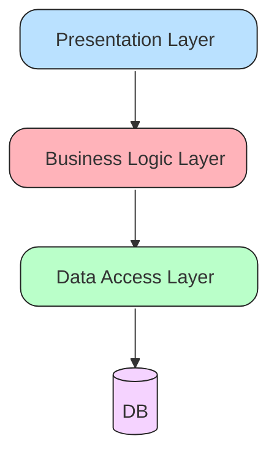

```mermaid
graph TD;
    A[Presentation Layer] --> B[Business Logic Layer];
    B --> C[Data Access Layer];
    C --> D[(DB)];

    style A fill:#bae1ff,stroke:#222,stroke-width:1px, rx:15, ry:15, width:200px, height:50px;
    style B fill:#ffb3ba,stroke:#222,stroke-width:1px, rx:15, ry:15, width:200px, height:50px;
    style C fill:#baffc9,stroke:#222,stroke-width:1px, rx:15, ry:15, width:200px, height:50px;
    style D fill:#f5d3ff,stroke:#222,stroke-width:1px, rx:15, ry:15, width:200px, height:50px;
```